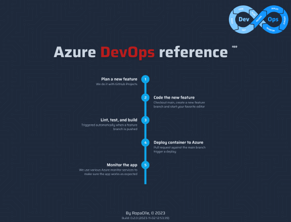
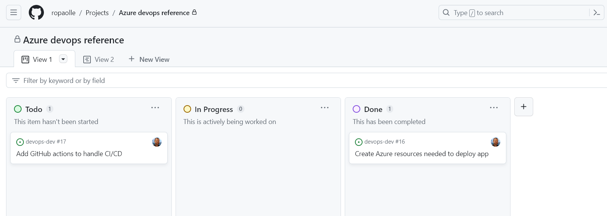

# Azure Devops Reference

Basic ci/cd pipeline that builds, tests, and deploys a NextJS app to Azure as a Docker container. The motivation for this repository was to implement a workflow based on the latest release for a few tools and frameworks using current best practices.

The pipeline is hosted on [Microsoft Azure](https://azure.microsoft.com/) and uses [GitHub Projects](https://docs.github.com/en/issues/planning-and-tracking-with-projects/learning-about-projects/about-projects) to plan and [GitHub Actions](https://github.com/features/actions) to lint, test, build, and deploy a [NextJS](https://nextjs.org/) app in a [Docker](https://www.docker.com/) container.

The workflow uses GitHub projects for planning. New functionality is created in a fresh feature branch. When the feature branch is pushed GitHub actions automatically run lint, tests and build our app. If that succeeds, we can merge the feature branch into the main branch. This will trigger a new action that builds a new Docker image and pushes it to our image registry in Azure. If that succeeds, we promote the image to our container app, spins up a fresh container and tear down the old container.

## CI/CD Workflow

### 1. Plan a new feature

The planning is done with GitHub Projects.

### 2. Code the new feature

A new feature is added by checking out the main branch and create a new feature branch using the naming pattern `feature/my-awesome-new-feature`. After that it is up to you. Take it away and code your awesome feature.

### 3. Lint, test, and build

By pushing the feature branch to origin you will trigger the [test action](.github/workflows/ci-github-prod.yml) that lint, test, and build the app. If a feature branch has passed all tests it is possible to create a pull request against the main branch.

### 4. Deploy container to Azure

A deploy is triggered by accepting a pull request against the main branch. This will trigger our [deploy action](.github/workflows/cd-azure-prod.yml) that will login to Azure, build a fresh Docker image, push it to the registry. And if that succeeds, we promote that image to our container ap p and replaces the existing container with a new one.

### 5. Monitor app

When our app is up and running we can use various Azure monitor services to make sure it works as expected. A couple of services that comes to mind are Azure Monitor metrics, Application logging and Azure Monitor alerts.
